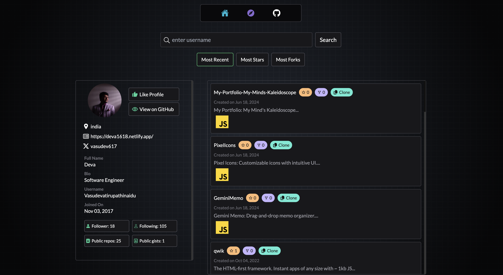
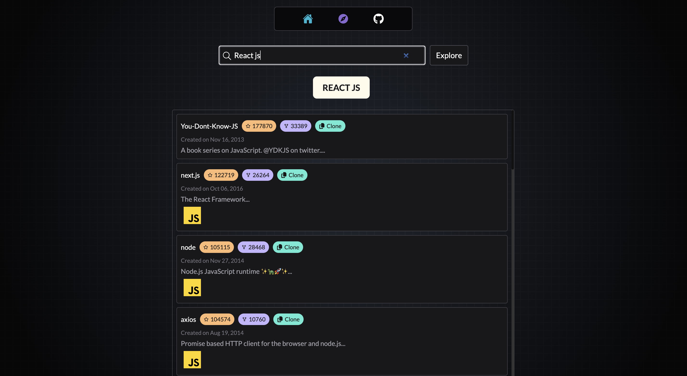

# Git Mapper

**Note:** Work in progress.

Git Mapper is a web tool designed to streamline the navigation and search of developers and their repositories on GitHub. With a sleek and intuitive UI design, Git Mapper provides an easy and enjoyable user experience. The tool allows users to search for developers and repositories based on recency, stars, and forks, as well as explore top favorite repositories.

- **Front-end:** React.js, TailwindCSS.
- **Back-end:** Node.js, Express.js, MongoDB (Mongoose) and Passport.js.
- **Others:** Vite (Frontend tooling) and Netlify (Hosting).

## Demo





## Features

  ### Front-end
- [x] **Search Developers and Repositories:** Easily search for developers and repositories based on recency, stars, and forks.
- [x] **Explore Top Repositories:** Browse through top favorite repositories.
- [x] **User Profile Display:** View detailed GitHub user profiles.
- [x] **Repository Management:** Manage repositories with options to star and fork.

  ### Back-end
  #### Features to be added in the next version:

  - [ ] Profile Liking: Like developer profiles and view them in a "Liked" section.
  - [ ] Authentication: Secure user authentication using Passport.js.
  - [ ] Database Management: Efficient storage and retrieval of data using MongoDB and Mongoose.
  - and many more...

## Installation

Follow these steps to set up Git Mapper on your local machine:

1. Fork the repository on GitHub.

2. Clone the repository:

   ```bash
   git clone https://github.com/yourusername/GitMapper.git
   cd GitMapper
   ```

3. Install dependencies:

   ```bash
   npm install
   ```

4. Start the development server:

   ```bash
   npm run dev
   ```

   The app will now be running on `http://localhost:5173/` or another port.

## Configuration

To use the Git API, you need to obtain your API key and configure it in the project. Follow these steps:

1. Get your Git API key `API_KEY` from the Git API provider.

2. Set up the API key in the project configuration:

   - Navigate to `frontend/.env`.

   - Initialize the API key in your code:
     ```bash
     // Initialize the API key
     VITE_GITHUB_API_KEY = API_KEY;
     ```

## Usage

1. **Search:** Allows users to search for GitHub developers and repositories.
2. **Sort Repositories:** Provides sorting options for repositories based on recency, stars, and forks.
3. **Profile Info:** Displays the user's GitHub profile information.
4. **Explore:** Allows users to explore top favorite repositories.

## Contact

If you have any questions or suggestions, feel free to open an issue or reach out to me!

<a href="https://github.com/Vasudevatirupathinaidu" target="_blank"></a> <a href="https://medium.com/@tirupathinaidu" target="_blank"></a> <a href="https://dev.to/deva" target="_blank"></a> <a href="https://twitter.com/vasudev617" target="_blank"></a> <a href="https://www.youtube.com/@vasudev16180" target="_blank"></a>
